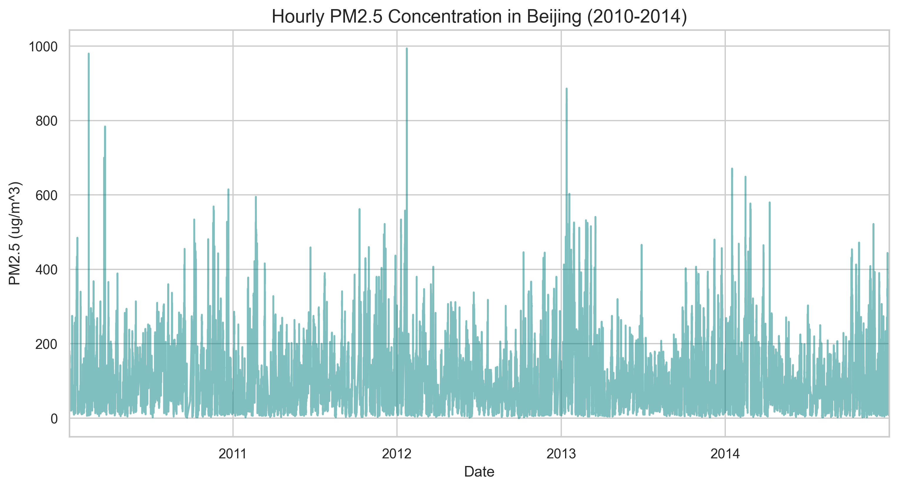
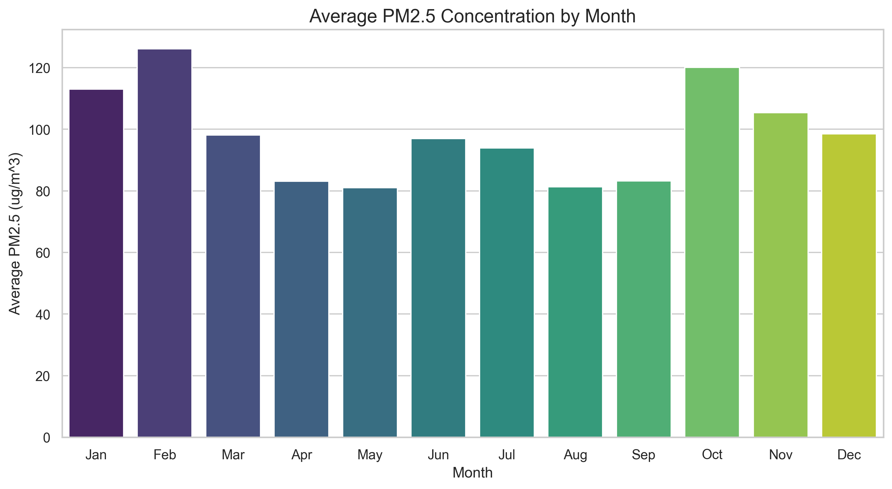
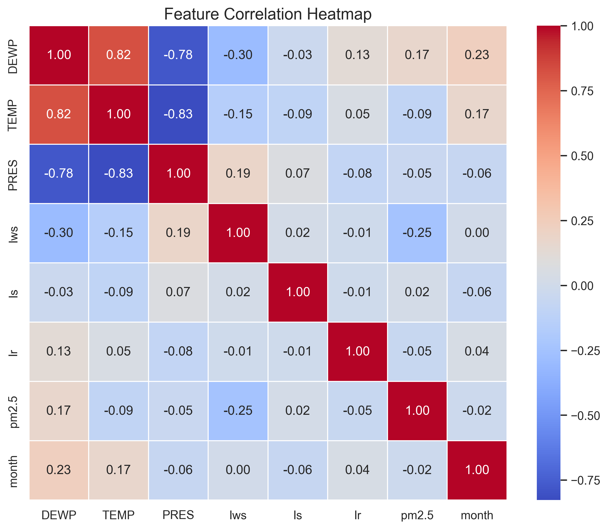
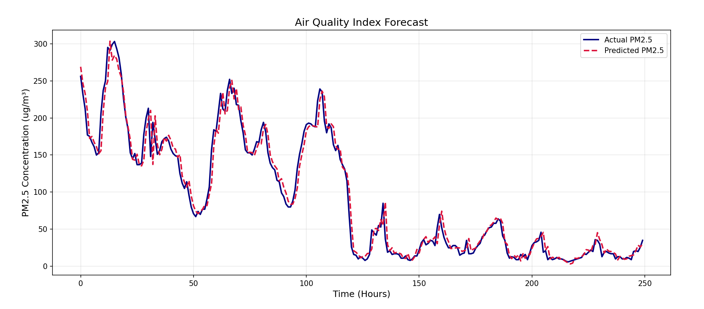

# Air Quality Index (AQI) Forecasting

[](https://www.tensorflow.org/)
[](https://pandas.pydata.org/)
[](https://www.python.org/)

## Abstract

Air pollution remains a critical environmental and public health issue, particularly in urban areas where PM2.5 concentration levels can fluctuate rapidly. This study presents a machine learning approach for short-term air quality forecasting using the Beijing PM2.5 dataset. The problem is formulated as a time-series regression task, where historical environmental and meteorological observations are used to predict future PM2.5 concentrations.

To capture temporal dependencies, a Long Short-Term Memory (LSTM) neural network is employed. The data is preprocessed through linear interpolation for missing values, one-hot encoding for categorical variables, and Min-Max normalization for feature scaling. A sliding window technique is applied to convert the data into sequences of 24-hour intervals, enabling the model to learn patterns over time. The dataset is split chronologically to avoid data leakage and to simulate real-world forecasting conditions.

The proposed model achieves a Mean Absolute Error (MAE) of 10.56 ug/m³ and a Root Mean Squared Error (RMSE) of 17.73 ug/m³ on the test set. Results demonstrate that the model effectively captures overall trends in air pollution, with minor limitations during abrupt fluctuations. This work highlights the potential of LSTM-based models for practical air quality prediction systems.

## Project Overview

This project addresses the problem of short-term air quality forecasting by predicting PM2.5 concentration levels using historical environmental and meteorological data. Given the sequential nature of air pollution dynamics, the task is formulated as a time-series regression problem, where past observations are leveraged to estimate future values.

Unlike traditional regression approaches that assume independent samples, this study explicitly models temporal dependencies, recognizing that air quality is influenced by prior conditions such as weather patterns and pollutant accumulation.

## Dataset and Problem Formulation

The dataset used is the Beijing PM2.5 dataset obtained from the UCI Machine Learning Repository. It consists of hourly measurements including atmospheric conditions and pollutant levels.

### Key Features

- Meteorological variables (temperature, pressure, dew point)
- Wind-related attributes (direction and speed)
- Environmental indicators (rain, snow)
- Target variable: PM2.5 concentration

### Task Definition

Given a sequence of past observations over a fixed time window (24 hours), the model predicts the PM2.5 concentration at the next time step. This captures the autoregressive nature of air pollution.

## Documentation and Implementation Details

The implementation is modularized to ensure reproducibility and high-integrity pipeline standards. Detailed step-by-step documentation for the pipeline components can be found in the following files:

- [Pipeline Documentation Part 1: Ingestion and Preprocessing](doc/PIPELINE_DOCUMENTATION.md): Covers modular loading, categorical encoding, and feature scaling rationale.
- [Pipeline Documentation Part 2: Splitting and Leakage Prevention](doc/PIPELINE_DOCUMENTATION_PT2.md): Details the chronological splitting strategy and Min-Max scaler fitment logic to prevent information leakage.

### Data Preprocessing

- **Missing Data Handling**: PM2.5 values were addressed using linear interpolation to preserve temporal continuity.
- **Categorical Encoding**: Variables such as wind direction were transformed using one-hot encoding from pandas.
- **Feature Scaling**: All features were normalized using MinMax scaling to stabilize gradient updates.
- **Temporal Windowing**: The dataset was transformed into overlapping 24-hour sequences using a sliding window approach.

### Model Architecture

The LSTM-based neural network architecture consists of:

- A stacked LSTM structure (64 -> 32 units)
- Dropout layers (0.2) for regularization
- A fully connected output layer for regression
- Optimizer: Adam
- Loss Function: Mean Squared Error (MSE)

## Exploratory Data Analysis

Before modeling, an extensive analysis of the dataset was conducted to understand the temporal patterns and feature relationships of PM2.5 concentrations in Beijing.

### Temporal Trends

The PM2.5 levels show significant hourly and daily fluctuations, often characterized by sharp spikes followed by gradual declines, likely corresponding to rapid changes in local weather conditions or industrial activity.


_Figure 1: Hourly PM2.5 Concentration in Beijing (2010-2014) showing high variability._

### Seasonality Patterns

Analysis of monthly averages reveals a distinct seasonal pattern. PM2.5 concentrations tend to be higher during the winter months, which may be attributed to a combination of meteorological factors (like temperature inversions) and increased coal burning for heating.


_Figure 2: Average PM2.5 Concentration by Month._

### Feature Correlations

A correlation heatmap was used to identify which meteorological variables most strongly influence PM2.5 levels. Observations indicate that pressure and dew point have notable relationships with air quality.


_Figure 3: Heatmap showing correlations between PM2.5 and meteorological features._

## Performance Analysis

The LSTM model's performance was evaluated on a held-out test set using metrics that quantify the error in the original units (ug/m³).

| Metric                             | Value       |
| :--------------------------------- | :---------- |
| **Mean Absolute Error (MAE)**      | 10.56 ug/m³ |
| **Root Mean Squared Error (RMSE)** | 17.73 ug/m³ |
| **R-squared (R²)**                 | 0.96        |

The R² score of 0.96 suggests that the model explains 96% of the variance in the target variable, indicating a highly effective fit for short-term forecasting.


_Figure 4: Comparison of Actual vs Predicted PM2.5 levels on the test set (First 250 hours)._

## Personal Perspective

Developing this air quality forecasting system has been a profound journey into the intersection of environmental science and deep learning. Beyond the technical challenges of handling time-series data and preventing leakage, this project highlights the real-world impact of predictive modeling.

Seeing the seasonal trends clearly manifest in the data—where winter months consistently show dangerous air quality levels—serves as a stark reminder of the environmental challenges faced by major urban centers. It is rewarding to see that an LSTM architecture can capture these complex dependencies with such high accuracy (R² = 0.96), providing a tool that could theoretically help in issuing public health warnings or informing policy. This project has reinforced my belief that data-driven solutions are essential for tackling global public health crises.

## Getting Started

### Prerequisites

- Python 3.8+
- pip

### Installation

1.  Create and activate a virtual environment:
    ```bash
    python -m venv .venv
    # Windows
    .venv\Scripts\activate
    # macOS/Linux
    source .venv/bin/activate
    ```
2.  Install dependencies:
    ```bash
    pip install -r requirements.txt
    ```
3.  Install developer tools (Optional):
    ```bash
    pnpm install
    ```
    
## Project Structure

- `src/data_loader.py`: Handles data ingestion, cleaning, and local caching.
- `src/data_preprocessing.py`: Implements one-hot encoding, normalization, and chronological windowing.
- `src/train.py`: Defines the LSTM architecture and handles the training process.
- `src/evaluate.py`: Generates predictions, performs inverse scaling, and calculates final metric reports.
- `data.ipynb`: Interactive sandbox for exploration and initial model design.

## Citation

Chen, S. (2015). Beijing PM2.5 [Dataset]. UCI Machine Learning Repository. https://doi.org/10.24432/C5JS49.

## License

This project is licensed under the MIT License - see the [LICENSE](LICENSE) file for details.
